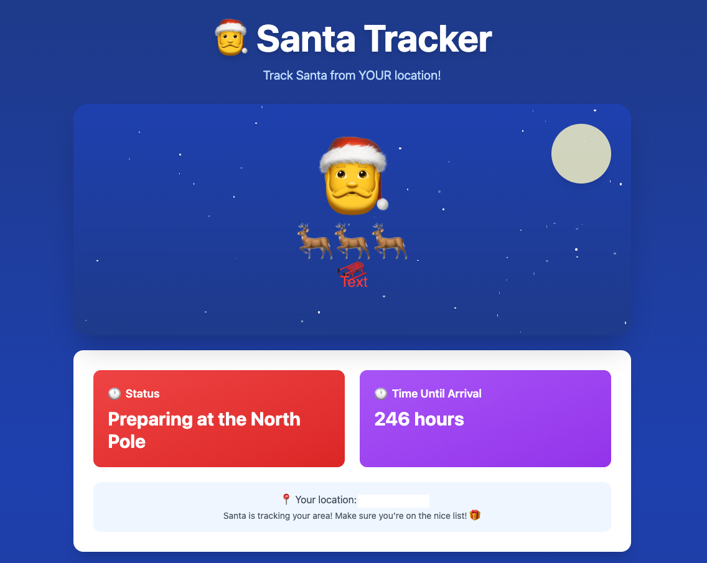
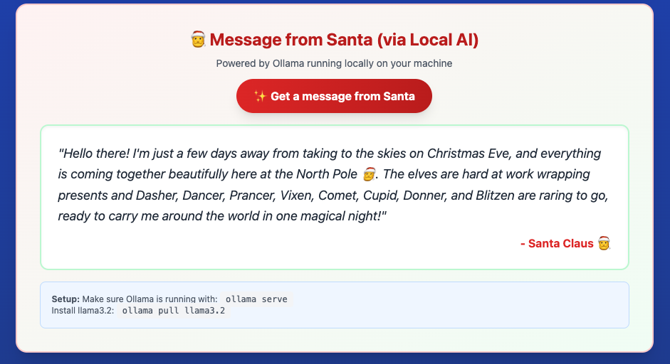

# 🎅 Santa Tracker - Local AI Edition

Track Santa's Christmas Eve journey around the world from YOUR exact location, with personalized messages powered by **local AI** (no cloud APIs, complete privacy!).


## ✨ Features

- 🌍 **Real-time Santa tracking** - See exactly where Santa is on Christmas Eve
- 📍 **Location-based perspective** - Calculate Santa's distance from YOUR location (opt-in only, with your explicit consent)
- 🤖 **AI-powered messages** - Get personalized greetings from Santa using Ollama + configurable LLM models
- 🎨 **Beautiful animations** - Twinkling stars, bouncing sleigh, festive visuals
- 🔒 **100% Local & Private** - No external API calls, all processing on your machine
- ⏱️ **Live countdown** - See when Santa will reach your area
- 🎁 **Gift counter** - Track how many presents Santa has delivered

## 🎬 Demo




Santa's journey is calculated based on real Christmas Eve timing - he starts at the International Date Line at 6 PM on December 24th and travels westward, completing his global delivery run by 6 AM on December 25th.

## 🚀 Quick Start

### Prerequisites

- Python 3.x
- [Ollama](https://ollama.ai/) installed
- Llama 3.2 model (3B variant recommended)

### Installation

1. **Clone the repository**
   ```bash
   git clone https://github.com/yourusername/santa-tracker-local-ai.git
   cd santa-tracker-local-ai
   ```

2. **Install and setup Ollama**
   ```bash
   # Install Ollama from https://ollama.ai/

   # Pull the Llama 3.2 model (3B variant is the default)
   ollama pull llama3.2:3b

   # Or use the larger 1B variant for faster responses
   ollama pull llama3.2:1b
   ```

3. **Start Ollama** (in a separate terminal)
   ```bash
   # The server proxies requests, so no need for special CORS config
   ollama serve
   ```

4. **Start the web server**
   ```bash
   python3 server.py
   ```

5. **Open in your browser**

   Navigate to: `http://localhost:8000/santa-tracker.html`

## ⚙️ Configuration

The application supports environment variables for customization:

### Environment Variables

| Variable | Default | Description |
|----------|---------|-------------|
| `PORT` | `8000` | Port for the web server |
| `OLLAMA_URL` | `http://localhost:11434` | Ollama backend URL |
| `OLLAMA_MODEL` | `llama3.2:3b` | LLM model to use |

### Examples

**Change the application port:**
```bash
PORT=8080 python3 server.py
# Then access via http://localhost:8080/
```

**Use a different Ollama model:**
```bash
OLLAMA_MODEL=mistral:7b python3 server.py
```

**Connect to remote Ollama instance:**
```bash
OLLAMA_URL=http://192.168.1.100:11434 python3 server.py
```

**Combine multiple settings:**
```bash
PORT=3000 OLLAMA_MODEL=phi3:mini OLLAMA_URL=http://my-server:11434 python3 server.py
```

## 🎄 How It Works

### Santa's Route Calculation

Santa begins his journey at the International Date Line (longitude 180°) at 6:00 PM on December 24th and travels westward. The tracker:

1. Calculates Santa's current longitude based on elapsed delivery time
2. Uses your browser's geolocation API to get your coordinates
3. Computes the great-circle distance between you and Santa
4. Estimates arrival time based on longitude differential
5. Tracks total gifts delivered (2 billion by completion!)

### AI Integration

The app uses **Ollama** running locally to generate personalized Santa messages:

- Messages are context-aware (Santa's location, distance from you, delivery progress)
- Each message is unique and generated in real-time
- Completely private - no data leaves your machine
- Uses Llama 3.2:3b by default, but supports any Ollama-compatible model
- Configurable via environment variables for different models and backends

### Privacy-First Architecture

```
Browser → Python Server (configurable port) → Ollama (configurable URL)
   ↑                                              ↓
   └──────────── Local Machine Only ──────────────┘
```

The Python server acts as a CORS proxy, eliminating the need to configure Ollama with special settings. Everything runs locally by default, but can be configured to connect to remote Ollama instances if needed.

🔐 Your Privacy & Location Data

We take your privacy seriously:

- Location is 100% optional - The app works perfectly fine without sharing your location
- Explicit consent required - You must actively click "Share My Location" button
- Browser-controlled - Your browser's geolocation API handles the permission
- Never stored - Your coordinates are only used for real-time calculations, never saved
- Never transmitted - Location data never leaves your browser, not even to the local server
- Revocable anytime - You can deny or revoke location permission at any time in browser settings

The location feature simply enhances the experience by showing Santa's distance from you. Without it, you can still track Santa globally and get AI-generated messages!

## 📁 Project Structure

```
santa-tracker-local-ai/
├── santa-tracker.html    # Main application (standalone React app)
├── santa-tracker.jsx     # React component source (for developers)
├── server.py            # Python HTTP server with Ollama proxy
└── README.md            # This file
```

## 🔧 Troubleshooting

### "Frosty connection" error?

**Check Ollama is running:**
```bash
# Verify Ollama is responding (default URL)
curl http://localhost:11434/api/tags

# For custom Ollama URL, replace with your configured URL
curl $OLLAMA_URL/api/tags

# Should return a list of installed models
```

**Verify Llama 3.2 is installed:**
```bash
ollama list
# Should show llama3.2:3b (or your configured model) in the list
```

**Custom Ollama URL not working:**
```bash
# Test connectivity to your custom Ollama instance
curl http://your-ollama-server:11434/api/tags

# Make sure the Ollama server allows external connections
# You may need to start Ollama with: OLLAMA_HOST=0.0.0.0 ollama serve
```

**Restart the server:**
```bash
# Stop server (Ctrl+C) and restart
python3 server.py
```

### Location not working?

- Make sure you're accessing via `http://localhost:8000` (not `file://`)
- Click "Allow" when your browser requests location permission
- Some browsers restrict geolocation on non-HTTPS - try Chrome or Firefox
- Check browser console (F12) for any error messages

### Server won't start?

**Port 8000 already in use:**
```bash
# Use a different port with environment variable
PORT=8080 python3 server.py
# Then access via http://localhost:8080/
```

**Ollama not found:**
```bash
# Make sure Ollama is installed and in your PATH
which ollama

# If not found, install from https://ollama.ai/
```

## 🛠️ Development

The app is built with:
- **React 18** (via CDN, no build step needed)
- **Tailwind CSS** (via CDN)
- **Python 3** (built-in http.server)
- **Ollama** (local LLM inference)

### Modifying the AI Prompts

Edit the `getSantaMessage` function in `santa-tracker.html`:

```javascript
const prompt = `You are Santa Claus! Write a cheerful, warm message...`;
```

### Changing the AI Model

Use the `OLLAMA_MODEL` environment variable to specify any Ollama-compatible model:

```bash
# Use Mistral instead of Llama
OLLAMA_MODEL=mistral:7b python3 server.py

# Use Phi3 mini model
OLLAMA_MODEL=phi3:mini python3 server.py

# Use Gemma model
OLLAMA_MODEL=gemma:7b python3 server.py
```

Available models depend on what you have installed in Ollama. Check with:
```bash
ollama list
```

### Customizing Santa's Route

Modify the `calculateSantaProgress` function to adjust:
- Start/end times
- Route path (currently follows a sine wave)
- Speed (total delivery hours)
- Gift count

## 🎁 Features Ideas / TODOs

- [ ] Add sound effects (sleigh bells, ho ho ho)
- [ ] Animated gift drops at user's location
- [ ] "Nice list" checker with AI
- [ ] Multiple language support
- [ ] Save favorite Santa messages
- [ ] Share tracker link with friends
- [ ] Add reindeer names and individual tracking
- [ ] Weather along Santa's route
- [ ] Chimney safety tips from Santa

## 🤝 Contributing

Contributions are welcome! Feel free to:

1. Fork the repository
2. Create a feature branch (`git checkout -b feature/amazing-feature`)
3. Commit your changes (`git commit -m 'Add amazing feature'`)
4. Push to the branch (`git push origin feature/amazing-feature`)
5. Open a Pull Request

## 📜 License

This project is licensed under the MIT License - see below:

```
MIT License

Copyright (c) 2024 Santa Tracker Local AI Contributors

Permission is hereby granted, free of charge, to any person obtaining a copy
of this software and associated documentation files (the "Software"), to deal
in the Software without restriction, including without limitation the rights
to use, copy, modify, merge, publish, distribute, sublicense, and/or sell
copies of the Software, and to permit persons to whom the Software is
furnished to do so, subject to the following conditions:

The above copyright notice and this permission notice shall be included in all
copies or substantial portions of the Software.

THE SOFTWARE IS PROVIDED "AS IS", WITHOUT WARRANTY OF ANY KIND, EXPRESS OR
IMPLIED, INCLUDING BUT NOT LIMITED TO THE WARRANTIES OF MERCHANTABILITY,
FITNESS FOR A PARTICULAR PURPOSE AND NONINFRINGEMENT. IN NO EVENT SHALL THE
AUTHORS OR COPYRIGHT HOLDERS BE LIABLE FOR ANY CLAIM, DAMAGES OR OTHER
LIABILITY, WHETHER IN AN ACTION OF CONTRACT, TORT OR OTHERWISE, ARISING FROM,
OUT OF OR IN CONNECTION WITH THE SOFTWARE OR THE USE OR OTHER DEALINGS IN THE
SOFTWARE.
```

## 🙏 Acknowledgments

- Built with ❤️ for the holiday season
- Powered by [Ollama](https://ollama.ai/)
- Uses [Llama 3.2](https://ai.meta.com/llama/) by Meta
- Inspired by NORAD's Santa Tracker

## 🎅 Final Notes

This is a fun, educational project demonstrating:
- Local AI inference with Ollama
- Privacy-first application design
- Real-time geolocation calculations
- Creative use of LLMs for personalized content
- Ethical handling of location data (browser-only, never stored or transmitted)

**Remember**: Santa only comes if you've been nice! 🎄✨

_P.S. - Your location is only used if you explicitly consent, and it never leaves your browser. Santa respects your privacy!_

---

**Star ⭐ this repo if Santa brought you joy!**

Made with 🎅 by sukanto-m
